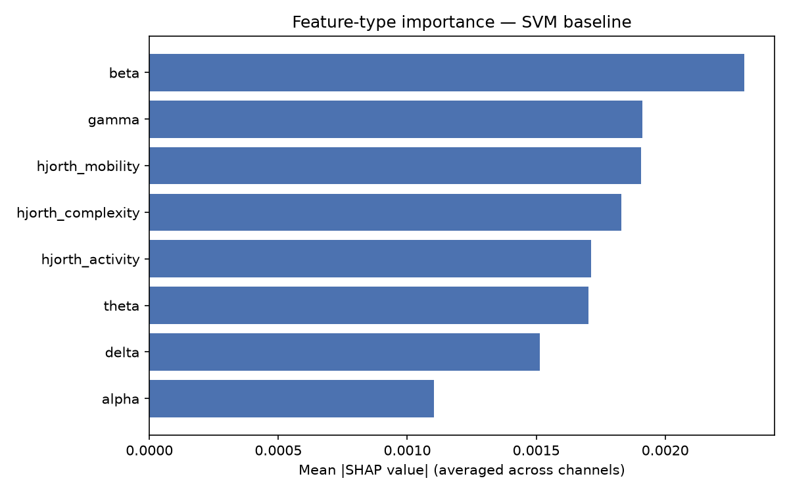
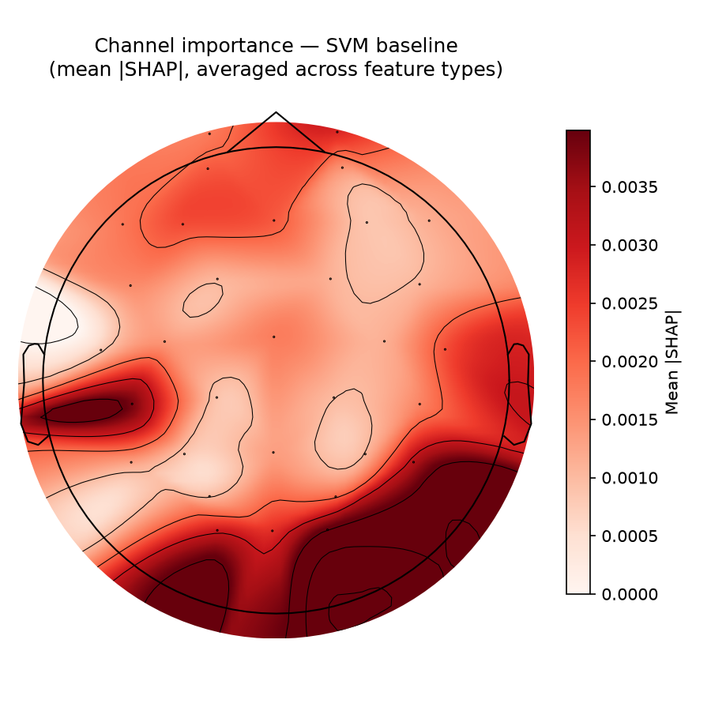

# Parkinson's Disease Detection from Resting-State EEG

[](https://github.com/KrasnyIwanowicz/parkinsons-eeg-classifier/actions/workflows/ci.yml)


## Overview

Parkinson's disease (PD) is currently diagnosed through observation of
motor symptoms — by the time those appear, substantial dopaminergic
neuron loss has already occurred. EEG is a cheap, non-invasive signal
that shows measurable differences between PD patients and healthy
controls (notably slowed cortical oscillations and increased
low-frequency power), which makes it an attractive candidate for
earlier, more accessible screening.

This project builds and rigorously evaluates a pipeline for classifying
PD vs. healthy control from resting-state EEG, comparing a classical
feature-based approach against sequence deep-learning models, with an
explicit focus on two things most student EEG projects skip:

1. **Subject-independent validation** (leave-one-subject-out CV) —
   without it, reported accuracy is largely measuring how well the
   model memorized each subject's individual noise signature, not
   whether it generalizes to a new person.
2. **Explainability** — a classifier that can't say *why* is a hard
   sell for anything medical-adjacent.

## Dataset

**UC San Diego Resting-State EEG Data from Patients with Parkinson's
Disease** — [OpenNeuro ds002778](https://openneuro.org/datasets/ds002778)

- 31 participants: 15 with PD, 16 healthy controls
- 32-channel BioSemi ActiveTwo system, 512 Hz sampling rate
- ~3 minutes of eyes-open resting-state recording per participant
- Standard 10-20 electrode placement, BIDS-formatted

**Citation:**
> Swann, N.C. (2021). UC San Diego Resting State EEG Data from Patients
> with Parkinson's Disease. OpenNeuro. Dataset.
> https://doi.org/10.18112/openneuro.ds002778.v1.0.5

**Structure, as actually shipped** (verified against the dataset repo,
not assumed): there is no "Group" column in `participants.tsv` — the
label lives in the subject ID prefix itself (`sub-hc*` = control,
`sub-pd*` = PD). Healthy controls have a single session (`ses-hc`); PD
patients have **two** sessions, off-medication (`ses-off`) and
on-medication (`ses-on`). This repo's loader defaults to the
off-medication session for the PD-vs-control comparison, so medication
state doesn't confound the group difference. Raw EEG ships as `.bdf`.

**⚠️ A note from the dataset's own maintainers, verbatim from their
README, that matters a lot for how you frame any results here:**
> "An example of an analysis that we could consider problematic ... would
> be using machine learning to classify Parkinson's patients from
> healthy controls using this dataset. This is because there are far
> too few patients for proper statistics... We strongly advise against
> using any such approach because it would mislead patients and people
> who are interested in knowing if they have Parkinson's disease."
>
> — Alex Rockhill (University of Oregon), dataset curator

This project still builds the classifier — that's the point of the
exercise — but treat it explicitly as a **methods/engineering
demonstration** (feature pipeline, validation rigor, explainability),
never as a diagnostic claim, and say so plainly wherever results are
reported. If this project is ever written up for anything more formal
than a portfolio (a paper, a competition submission), the dataset's
README asks that you email the curator first: arockhil@uoregon.edu.

The data is **not** included in this repository (clinical EEG data,
and large enough that it doesn't belong in git). To get it:

```bash
pip install openneuro-py
openneuro-py download --dataset ds002778 --target-dir data/raw
```

## Methodology

**Preprocessing** (`src/preprocessing.py`): 1–45 Hz band-pass filter,
50 Hz notch filter, average reference, ICA-based artifact removal,
2-second fixed-length epoching.

**Features** (`src/features.py`): spectral band power (delta, theta,
alpha, beta, gamma via Welch's method) and Hjorth parameters
(activity, mobility, complexity), per channel.

**Models compared** (`src/models.py`):
| Model | Type | Purpose |
|---|---|---|
| StandardScaler → PCA → SVM | Classical ML | Baseline / sanity floor |
| LSTM | Deep sequence model | Learns temporal structure directly |
| Attention-LSTM | Deep sequence model | Same, plus built-in explainability via attention weights |

**Validation** (`src/evaluation.py`): leave-one-subject-out
cross-validation via `sklearn.model_selection.LeaveOneGroupOut`,
reporting accuracy, ROC-AUC, and confusion matrix.

**Explainability** (`src/explainability.py`): SHAP values for the
baseline model; attention-weight extraction for the attention-LSTM —
two independent ways of answering "what drove this prediction?"

## Repository structure

```
├── configs/default.yaml            # all hyperparameters in one place
├── data/                           # raw/processed data (gitignored, download separately)
├── docs/roadmap.md                 # phased project roadmap + full debugging history
├── results/                        # final SHAP plots (regeneratable intermediate results gitignored)
├── scripts/
│   ├── run_experiment.py           # end-to-end: load → preprocess → features → LOSO-CV (SVM baseline)
│   ├── train_deep_model.py         # LOSO-CV for the LSTM / Attention-LSTM
│   └── explain_baseline.py         # SHAP explainability on the SVM baseline
├── src/
│   ├── data_loading.py             # BIDS/OpenNeuro loading, channel selection
│   ├── preprocessing.py            # filtering, ICA, epoching
│   ├── features.py                 # band power, Hjorth parameters
│   ├── dataset.py                  # per-subject sequence construction (for the deep models)
│   ├── models.py                   # baseline SVM pipeline + LSTM/Attention-LSTM
│   ├── deep_training.py            # training loop, seeding, standardization for the deep models
│   ├── evaluation.py               # leave-one-subject-out CV
│   └── explainability.py           # SHAP + attention-weight extraction
├── tests/                          # 17 tests, all on synthetic data — no dataset download needed for CI
└── .github/workflows/ci.yml        # tests + mypy run automatically on every push
```

## Setup

```bash
git clone https://github.com/KrasnyIwanowicz/parkinsons-eeg-classifier.git
cd parkinsons-eeg-classifier
python -m venv .venv && source .venv/bin/activate
pip install -r requirements.txt

# then download the dataset (see Dataset section above) into data/raw
```

## Usage

```bash
# baseline: SVM on hand-crafted features, LOSO-validated
python scripts/run_experiment.py --bids-root data/raw

# deep models: LSTM or Attention-LSTM, LOSO-validated
python scripts/train_deep_model.py --bids-root data/raw --model lstm --hidden-dim 16 --dropout 0.5 --weight-decay 1e-3 --n-train-epochs 10
python scripts/train_deep_model.py --bids-root data/raw --model attention --hidden-dim 16 --dropout 0.5 --weight-decay 1e-3 --n-train-epochs 10

# explainability: SHAP values + plots for the SVM baseline
python scripts/explain_baseline.py --bids-root data/raw

# test suite (synthetic data, no download needed) + type check
pytest tests/ -v
mypy src/ --ignore-missing-imports
```

## Results

**Baseline (StandardScaler → PCA(10) → SVM), leave-one-subject-out CV,
n = 31, 32 scalp EEG channels, log-scaled power features:**

| Level | Accuracy | ROC-AUC | Confusion matrix |
|---|---|---|---|
| Epoch-level (n = 3009 epochs) | 0.593 | 0.580 | `[[808, 712], [516, 973]]` |
| **Subject-level** (majority vote, n = 31) | **0.581** | **0.580** | `[[8, 8], [5, 10]]` |

PCA(10) was checked against skipping PCA entirely and against 30/50
components — none beat it (skipping PCA entirely actually dropped
accuracy below chance, 0.419, since 256 raw features through an
RBF-kernel SVM with ~30 training subjects per fold is exactly the
regime where PCA provides real regularization, not just an arbitrary
bottleneck). This is the SVM's genuine ceiling on this feature set, not
an unlucky hyperparameter choice.

**Final three-way comparison** (all models on identical, corrected —
log-scaled, 32-channel — features):

| Model | Accuracy (subject-level, n=31) | ROC-AUC |
|---|---|---|
| SVM baseline (deterministic, best of 4 PCA settings) | 0.581 | 0.580 |
| **LSTM** (mean ± SD, 3 seeds) | **0.667 ± 0.074** | **0.686 ± 0.075** |
| Attention-LSTM (mean ± SD, 3 seeds) | 0.538 ± 0.049 | 0.514 ± 0.108 |

**The LSTM wins.** This reverses an earlier (incorrect) conclusion from
before a feature-scaling bug was fixed — see the history in
[docs/roadmap.md](docs/roadmap.md) Phase 2/3 for the full debugging
trail. With the bug fixed, the LSTM's ability to model temporal
structure across each subject's ~90-140 epochs gives it real signal that
a per-epoch hand-crafted-feature SVM can't capture. The plain LSTM beats
the Attention-LSTM too — attention didn't help here, plausibly because
31 subjects isn't enough data to usefully learn *which* time windows to
attend to, on top of the base sequence-modeling task.

An AUC of ~0.69 under honest LOSO validation, averaged across 3 random
seeds, on n = 31 is a real, non-trivial result — still not remotely
close to diagnostic reliability (see Limitations and the dataset
curators' own caveat above), but a legitimate signal that survived
subject-level validation, a corrected feature pipeline, and a fair
hyperparameter search for the baseline it's being compared against.

**SHAP explainability (Phase 3), on the SVM baseline:**

Feature-type importance, once the log-transform fix was in place, is
sensible and non-degenerate — beta and gamma power lead, alpha is
lowest, all 8 feature types contribute (no more exact zeros):

| Feature type | Mean \|SHAP\| |
|---|---|
| beta | 0.00231 |
| gamma | 0.00191 |
| hjorth_mobility | 0.00191 |
| hjorth_complexity | 0.00183 |
| hjorth_activity | 0.00171 |
| theta | 0.00170 |
| delta | 0.00151 |
| alpha | 0.00110 |

Top channels: O2, CP5, P8, O1, Fp2, Oz, F3, T8, AF3, Fz — occipital
(O1/O2/Oz) and frontal (Fp2/AF3) electrodes lead, with temporal/parietal
channels (CP5/P8/T8/F3) also present.





**Important interpretive caveat, independent of the numbers above:**
occipital and frontal electrodes are exactly the sites most susceptible
to two artifacts that correlate with PD status rather than reflecting
cortical signal directly: frontal electrodes pick up residual
eye-movement/blink signal even after ICA cleaning (and PD patients have
documented differences in blink rate), and PD involves motor symptoms
(tremor) that can bleed into signal amplitude/complexity measures. This
project cannot rule out that some of the SHAP-identified importance
reflects these confounds rather than pure cortical activity — that's an
open question, not a settled one, and is stated here rather than
glossed over.

## Limitations

- **n = 31 (15 PD, 16 control) is too small for statistically reliable
  diagnostic claims — the dataset's own curators say so explicitly**
  (see the callout above). With leave-one-subject-out CV, every subject
  is tested exactly once, which is a fairer evaluation than a single
  fixed train/test split, but it does not fix the fundamental
  small-sample problem. Treat any accuracy/AUC number this project
  produces as an engineering proof-of-concept, not evidence of
  real-world diagnostic validity.
- Single-site, single-recording-protocol data; nothing here has been
  validated on an independent cohort or a different EEG system.
- UPDRS-style clinical ratings referenced in the dataset were collected
  by trained lab personnel, not a board-certified neurologist — treat
  any analysis leaning on disease-severity labels with extra caution.
- Not intended for, and not validated for, actual clinical diagnostic
  use.
- **Hyperparameter search was limited, not exhaustive.** The SVM baseline
  was checked against 4 PCA settings (0/10/30/50 components); the deep
  models used one fixed architecture (hidden_dim=16, dropout=0.5,
  weight_decay=1e-3) chosen to fix an overfitting problem found during
  development, not tuned via a systematic search. The LSTM's advantage
  over the SVM held up across all 3 seeds tried, which is reassuring,
  but 3 seeds and one hyperparameter setting is not the same as a proper
  sweep — a different architecture or training budget could shift these
  numbers further.
- **The LSTM's result carries real run-to-run variance** (0.667 ± 0.074
  accuracy across 3 seeds — a 15-point spread from lowest to highest
  seed). The direction of the result (LSTM > SVM > chance for
  Attention-LSTM) was consistent across seeds, but the exact numbers
  should be read as "roughly this good," not as a precise point estimate.
- See the artifact-confound caveat in the Results section above
  (occipital/frontal SHAP importance may partly reflect eye-movement or
  tremor artifact rather than pure cortical signal) — an open question,
  not resolved by anything in this repository.

## References

- Swann, N.C. (2021). UC San Diego Resting State EEG Data from Patients
  with Parkinson's Disease. OpenNeuro. https://doi.org/10.18112/openneuro.ds002778.v1.0.5
- Jackson, N., Cole, S.R., Voytek, B., Swann, N.C. (2019). Characteristics
  of Waveform Shape in Parkinson's Disease Detected with Scalp
  Electroencephalography. *eNeuro*, 6(3). https://doi.org/10.1523/ENEURO.0151-19.2019
- Swann, N.C. et al. (2015). Elevated synchrony in Parkinson disease
  detected with electroencephalography. *Ann Neurol*, 78(5), 742-750.
- Delorme, A. & Makeig, S. (2004). EEGLAB: an open-source toolbox for
  analysis of single-trial EEG dynamics. *Journal of Neuroscience
  Methods*, 134, 9–21.
- Appelhoff, S. et al. (2019). MNE-BIDS: Organizing electrophysiological
  data into the BIDS format. *JOSS*, 4(44), 1896.

*If you ever submit anything based on this dataset for formal
publication (not just a portfolio/school project), the dataset
maintainers ask to be emailed first — see the callout in the Dataset
section above.*

## License

MIT — see [LICENSE](LICENSE).
